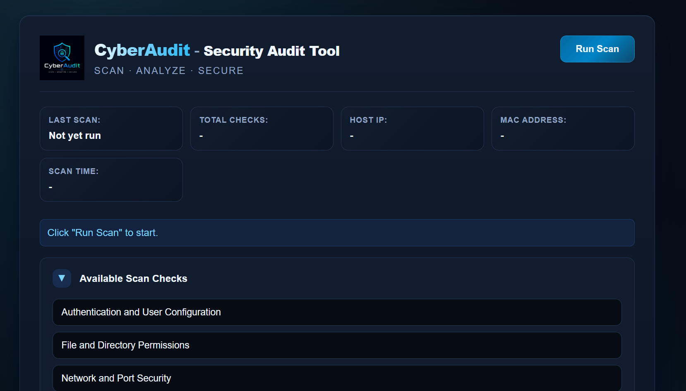
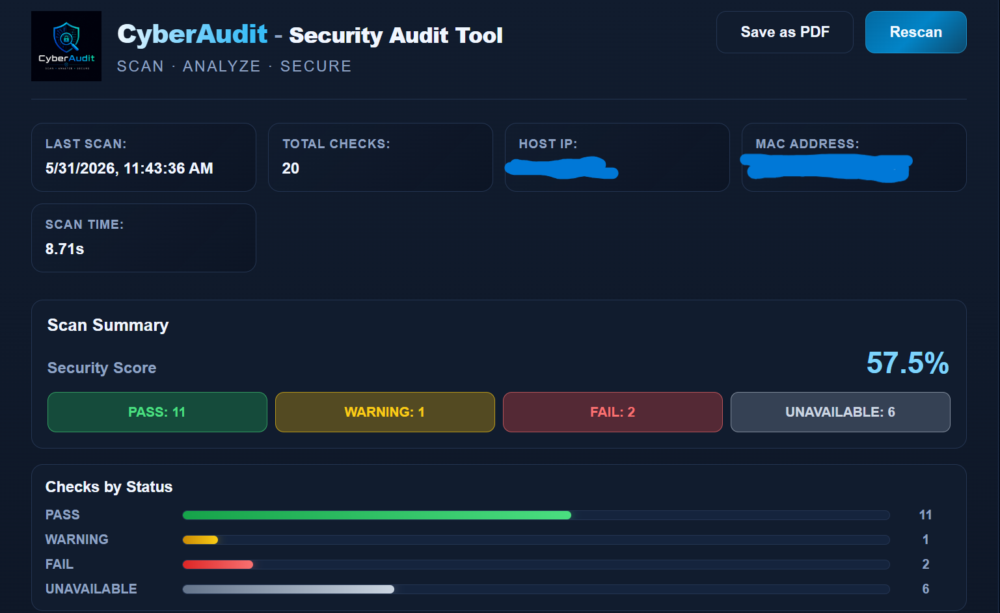
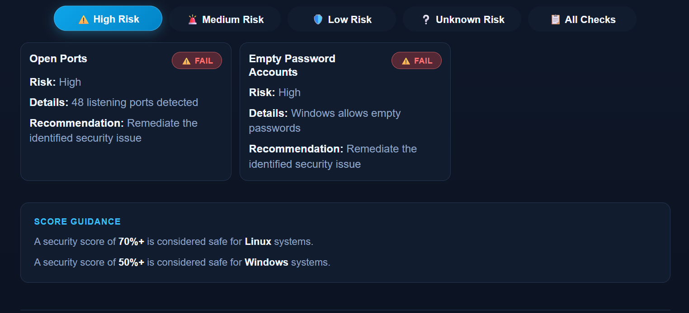
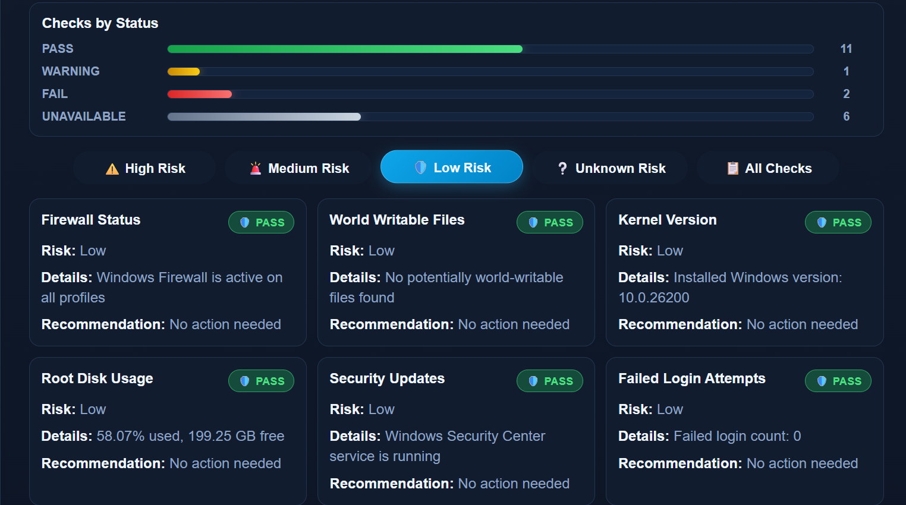
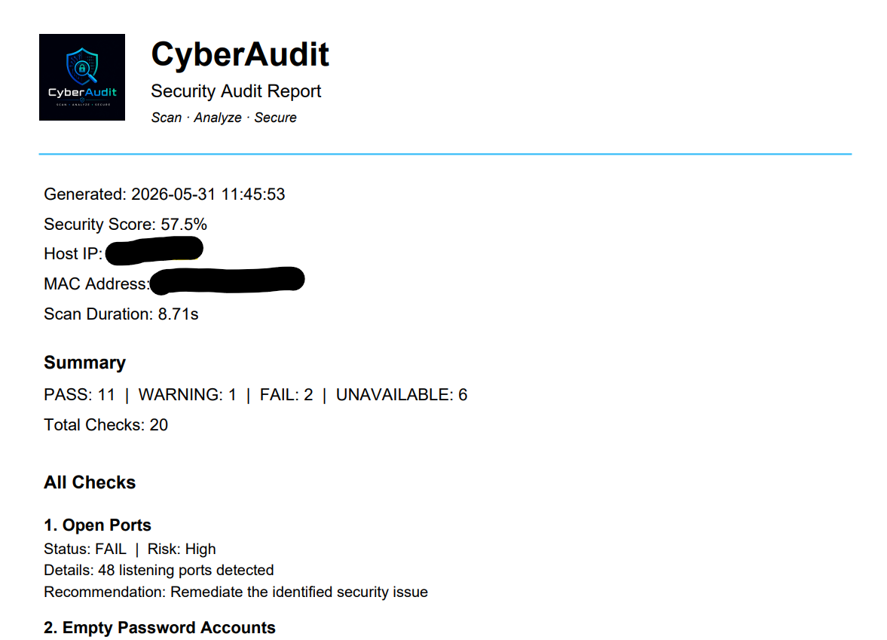

# CyberAudit

A cross-platform security auditing dashboard built using Python, Flask, React, and JavaScript.

CyberAudit performs automated security and configuration audits on both Linux and Windows systems, providing actionable findings through a modern web dashboard.

---

# Installation

## Clone Repository

```bash
git clone https://github.com/avish-attri/CyberAudit.git
cd CyberAudit
```

---

# Quick Setup

## Linux

```bash
chmod +x setup.sh
./setup.sh
```

## Windows

```cmd
./setup.sh
```

---

# Manual Setup

## Create Virtual Environment

```bash
python -m venv venv
```

## Activate Environment

### Linux

```bash
source venv/bin/activate
```

### Windows

```cmd
venv\Scripts\activate
```

---

## Install Dependencies

```bash
pip install -r requirements.txt
```

---

## Run Application

```bash
python app.py
```

---

# Open Dashboard

Visit:

```text
http://127.0.0.1:5000/scan
```

---

# How CyberAudit Works

```text
User clicks "Run Scan"
        ↓
React dashboard sends API request
        ↓
Flask backend receives request
        ↓
Platform detection occurs
        ↓
Linux or Windows scanners execute
        ↓
Results returned as JSON
        ↓
Dashboard updates dynamically
```

---

# API Endpoints

## Run Security Scan

```http
POST /api/scan
```

## Fetch Latest Results

```http
GET /api/scan-results
```

---

## Features

* Cross-platform security auditing
* Real-time scan dashboard
* Risk-level filtering
* Security score calculation
* Authentication audits
* Filesystem audits
* Network audits
* Service audits
* Logging audits
* PDF report export
  
---

# PDF Report Export

CyberAudit allows users to export scan results as a professional PDF report.

The generated report includes:

* Scan timestamp
* Security score
* Audit summary
* Detailed findings
* Risk levels
* Recommendations
* System information

This enables users to archive scan results, share reports, and track security improvements over time.

---

# Tech Stack

## Backend

* Python
* Flask
* Flask-CORS

## Frontend

* React
* JavaScript
* HTML
* CSS

# React Frontend

The frontend dashboard is built using React and rendered through:

```text
frontend/app.jsx
```

React is loaded through CDN inside:

```text
frontend/index.html
```

using:

* React
* ReactDOM
* Babel

This keeps the frontend lightweight without requiring a full React build setup.

---

# Project Structure

```bash
CyberAudit/
│
├── api/
│   └── routes.py
│
├── frontend/
│   ├── assets/
│   │   └── cyberaudit-logo.png
│   ├── index.html
│   ├── style.css
│   └── app.jsx
│
├── scanner/
│   ├── auth_checks.py
│   ├── filesystem_checks.py
│   ├── logging_checks.py
│   ├── network_checks.py
│   ├── service_checks.py
│   ├── system_checks.py
│   ├── windows_checks.py
│   ├── linux_checks.py
│   ├── scorer.py
│   ├── utils.py
│   └── main.py
│
├── app.py
├── requirements.txt
├── setup.sh
├── setup.bat
└── README.md
```

---

## Screenshots

### Dashboard



### Scan Results







### PDF Report Export



# Author

Avish Attri

GitHub:
https://github.com/avish-attri
